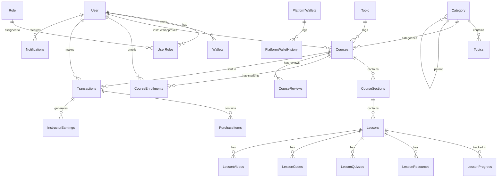

# Database Schema Documentation

This document provides a comprehensive overview of the database schema for the StudyNest application. It is intended to be used as context for AI models to generate SQL queries (Text-to-SQL) and for developers to understand the data structure.

## Entity-Relationship Diagram (ERD)

## Table Details

### 1. User & Authentication

#### `user`

Stories user accounts for students, instructors, and admins.

- **id** (UUID, PK): Unique identifier.
- **email** (String, Unique): User email.
- **password** (String): Hashed password.
- **fullname** (String): Full name.
- **role** (via `user_roles`): Many-to-Many with `role`.
- **wallets** (One-to-One): Link to `wallets` table.

#### `role`

Defines user roles (e.g., ADMIN, LECTURER, STUDENT).

- **id** (UUID, PK)
- **role_name** (String, Unique)

#### `user_roles`

Join table for User-Role relationship.

- **user_id** (FK `user.id`)
- **role_id** (FK `role.id`)

### 2. Course & Content Management

#### `categories`

Hierarchical categories for courses.

- **id** (UUID, PK)
- **name** (Text)
- **slug** (Text, Unique)
- **parent_id** (FK `categories.id`): Self-referencing for hierarchy.

#### `topics`

Specific topics belonging to a category.

- **id** (UUID, PK)
- **category_id** (FK `categories.id`)
- **name** (Text)

#### `courses`

Main course table.

- **id** (UUID, PK)
- **title** (Text)
- **instructor_id** (FK `user.id`): The creator/instructor.
- **category_id** (FK `categories.id`)
- **topic_id** (FK `topics.id`)
- **base_price** (Numeric): Price of the course.
- **is_published** (Boolean)
- **approval_status** (String): 'pending', 'approved', 'rejected'.

#### `course_sections`

Sections/Modules within a course.

- **id** (UUID, PK)
- **course_id** (FK `courses.id`)
- **title** (Text)
- **position** (Integer): Ordering.

#### `lessons`

Individual lessons (Video, Quiz, Article, etc.).

- **id** (UUID, PK)
- **section_id** (FK `course_sections.id`)
- **course_id** (FK `courses.id`)
- **title** (Text)
- **lesson_type** (Enum): 'video', 'article', 'quiz', 'code', 'assignment', 'resource'.
- **position** (Integer)

#### `lesson_videos`

Details for video lessons.

- **lesson_id** (PK, FK `lessons.id`): One-to-One with Lessons.
- **video_url** (Text)
- **duration** (Float)

#### `lesson_resources`

supplementary resources for lessons.

- **lesson_id** (FK `lessons.id`)
- **url** (Text)

### 3. Learning & Engagement

#### `course_enrollments`

Tracks user enrollments in courses.

- **id** (UUID, PK)
- **user_id** (FK `user.id`)
- **course_id** (FK `courses.id`)
- **enrolled_at** (DateTime)
- **progress** (Numeric): % completion.

#### `lesson_progress`

Tracks completion of individual lessons.

- **id** (UUID, PK)
- **user_id** (FK `user.id`)
- **lesson_id** (FK `lessons.id`)
- **is_completed** (Boolean)

#### `course_reviews`

User reviews and ratings.

- **id** (UUID, PK)
- **course_id** (FK `courses.id`)
- **user_id** (FK `user.id`)
- **rating** (SmallInteger): 1-5 stars.
- **content** (Text)

### 4. Finance & Payments

#### `transactions`

Central table for all financial transactions (In/Out).

- **id** (UUID, PK)
- **user_id** (FK `user.id`)
- **amount** (Numeric)
- **type** (String): 'deposit', 'withdraw', 'payment', 'refund'.
- **status** (String): 'pending', 'completed', 'failed'.
- **course_id** (Optional, FK `courses.id`)

#### `purchase_items`

Details of items bought in a transaction (Cart support).

- **id** (UUID, PK)
- **transaction_id** (FK `transactions.id`)
- **course_id** (FK `courses.id`)
- **original_price** (Numeric)
- **discounted_price** (Numeric)

#### `instructor_earnings`

Tracks earnings for instructors per sale.

- **id** (UUID, PK)
- **transaction_id** (FK `transactions.id`)
- **instructor_id** (FK `user.id`)
- **amount_instructor** (Numeric): Net amount for instructor.
- **amount_platform** (Numeric): Fee taken by platform.
- **status** (String): 'holding', 'paid'.

#### `wallets`

User's internal wallet balance.

- **id** (UUID, PK)
- **user_id** (FK `user.id`)
- **balance** (Numeric)

#### `withdrawal_requests`

Requests for payout by instructors.

- **id** (UUID, PK)
- **lecturer_id** (FK `user.id`)
- **amount** (Numeric)
- **status** (String)

#### `refund_requests`

Refund handling.

- **id** (UUID, PK)
- **purchase_item_id** (FK `purchase_items.id`)
- **status** (String)

### 5. Discounts

#### `discounts`

Coupon codes and sales.

- **id** (UUID, PK)
- **code** (String)
- **percent_value** (Numeric)
- **fixed_value** (Numeric)

#### `discount_targets`

Scope of discount (Specific Course/Category).

- **discount_id** (FK `discounts.id`)
- **course_id** (FK `courses.id`)

### 6. AI & Advanced Features

#### `user_embedding_history`

Vector embeddings of user interactions for recommendations.

- **user_id** (FK `user.id`)
- **course_id** (FK `courses.id`)
- **embedding** (VECTOR)

#### `tutor_chat_threads` & `tutor_chat_messages`

AI Tutor chat history.

- **thread_id** (UUID)
- **content** (Text)
- **role** (String): 'user', 'assistant'.

---

## SQL Generation Tips for AI

- **Joins**: Always join `courses` with `user` (as instructor) using `courses.instructor_id = user.id`.
- **Enrollments**: To count students, count distinct `user_id` in `course_enrollments`.
- **Revenue**: Use `purchase_items.discounted_price` for Gross Sales. Use `instructor_earnings.amount_instructor` for Instructor Net Income.
- **Progress**: `lesson_progress` tracks individual item completion. Course completion % is stored in `course_enrollments.progress` but better calculated dynamically if needed.
- **Vector Search**: Tables with `embedding` column (`courses`, `lessons`) support `pgvector` operations (cosine distance).
