# Thiết Kế Cơ Sở Dữ Liệu - Hệ Thống Gamification (StudyNest) - Phiên Bản Enterprise 2.0

Tài liệu này đặc tả thiết kế cơ sở dữ liệu (Database Schema) và mô hình kiến trúc ở mức **Enterprise** cho hệ thống Gamification của StudyNest. Toàn bộ thiết kế được tối ưu hóa cho môi trường phân tán, tải cao, bảo mật chặt chẽ và khả năng mở rộng trọn vẹn trong nhiều năm mà không cần thay đổi schema cốt lõi.

---

## 1. Quy Tắc Naming Convention & Chuẩn Hóa Dữ Liệu (Naming Conventions)

Để đảm bảo tính nhất quán trên toàn bộ hệ thống cơ sở dữ liệu PostgreSQL, tất cả các thực thể phải tuân thủ nghiêm ngặt các quy tắc đặt tên và cấu trúc sau:

1. **Tên Bảng và Cột (snake_case)**:
   - Sử dụng chữ thường, số (nếu cần) và dấu gạch dưới để phân tách (Ví dụ: `user_gamification_profiles`, `total_peak_score`).
   - Tên bảng luôn để ở số nhiều (Ví dụ: `seasons`, `achievements`, `rewards`).
2. **Khóa Chính (Primary Keys - PK)**:
   - Luôn sử dụng UUIDv4 được tạo tự động bằng `gen_random_uuid()` làm khóa chính cho tất cả các bảng cấu hình và runtime để hỗ trợ phân tán và tránh suy đoán ID (Idempotency).
   - Tên cột khóa chính luôn là `id`.
   - Ngoại lệ: Bảng `levels_config` dùng cột `level` (Integer) làm PK.
3. **Khóa Ngoại (Foreign Keys - FK)**:
   - Tên cột khóa ngoại phải kết thúc bằng `_id` và khớp với tên thực thể cha ở dạng số ít (Ví dụ: `season_id` tham chiếu đến `seasons.id`).
   - Đặt tên ràng buộc khóa ngoại theo cấu trúc: `fk_<tên_bảng_nguồn>_<cột_nguồn>` (Ví dụ: `fk_user_missions_user_id`).
4. **Chỉ Mục (Indexes - IDX)**:
   - Tên chỉ mục đặt theo cấu trúc: `idx_<tên_bảng>_<các_cột>` (Ví dụ: `idx_peak_transactions_user_id_created_at`).
   - Mọi khóa ngoại phải có chỉ mục tương ứng để tối ưu hóa hiệu năng câu lệnh JOIN.
5. **Dấu Vết Kiểm Toán (Audit Fields)**:
   - Mọi bảng thuộc tầng **Configuration** và **Runtime** phải có 2 cột:
     - `created_at` (Timestamp với timezone, mặc định `now()`).
     - `updated_at` (Timestamp với timezone, mặc định `now()`, tự động cập nhật qua Trigger).
   - Tầng **Audit / Ledger** chỉ có cột `created_at` (do tính chất chỉ ghi, không bao giờ cập nhật).
6. **Xóa Mềm (Soft Delete)**:
   - Chỉ áp dụng cho các bảng cấu hình của Admin (`seasons`, `missions`, `rewards`, `achievements`, `badges`) bằng cột `deleted_at` (Timestamp với timezone, nullable).
   - Không áp dụng soft delete cho bảng Runtime và Audit để tránh lãng phí không gian lưu trữ và làm chậm hiệu năng quét bảng.

---

## 2. Tổ Chức Kiến Trúc 3 Tầng (3-Tier Database Architecture)

Hệ thống được chia thành 3 tầng dữ liệu tách biệt để tối ưu hóa khả năng đọc/ghi, lập chỉ mục (indexing), bảo mật và phân phối bộ nhớ đệm (caching).

```
┌─────────────────────────────────────────────────────────────────────────────┐
│                            A. CONFIGURATION LAYER                           │
│ (Mùa giải, Mốc cấp độ, Nhiệm vụ mẫu, Cửa hàng quà, Ranks, Hộp quà, Đập hộp)  │
│  - Dữ liệu do Admin quản lý qua CMS. Tần suất ghi cực thấp, đọc cực cao.     │
│  - Chiến lược: Preload & Cache toàn bộ vào Redis.                           │
└──────────────────────────────────────┬──────────────────────────────────────┘
                                       │
                                       ▼
┌─────────────────────────────────────────────────────────────────────────────┐
│                               B. RUNTIME LAYER                              │
│ (Hồ sơ user, Số dư ví Peak, Điểm danh, Nhiệm vụ được gán, Kho quà, Đổi quà) │
│  - Ghi và đọc liên tục từ phía Client di động/Web. Tải nặng.                │
│  - Chiến lược: Realtime, Cache (Redis Hash), Lazy Load, Optimistic Locking. │
└──────────────────────────────────────┬──────────────────────────────────────┘
                                       │
                                       ▼
┌─────────────────────────────────────────────────────────────────────────────┐
│                             C. AUDIT / LEDGER LAYER                         │
│ (Sổ cái ví Peak, Sổ cái EXP, Nhật ký hoạt động nghi vấn, Snapshots hạng)    │
│  - Tuyệt đối CHỈ INSERT, KHÔNG UPDATE, KHÔNG DELETE.                        │
│  - Chiến lược: Partitioning theo tháng, Archivability cao.                  │
└─────────────────────────────────────────────────────────────────────────────┘
```

---

## 3. Đặc Tả Chi Tiết Các Thực Thể (Entity Specification)

### A. Tầng Cấu Hình (Configuration Tables)

#### A1. `seasons`
* **Mục đích**: Quản lý mùa giải hoặc sự kiện giới hạn thời gian (ví dụ: Season 1, Halloween Event).
* **Các cột**:
  | Tên Cột | Kiểu Dữ Liệu | Nullable | Mặc Định | Mô tả & Ràng buộc |
  | :--- | :--- | :--- | :--- | :--- |
  | `id` | UUID | No | gen_random_uuid() | Khóa chính |
  | `name` | Text | No | - | Tên mùa giải hiển thị |
  | `code` | String(50) | No | - | Unique Code để định dạng hệ thống (ví dụ: `season_1`) |
  | `start_date` | Date | No | - | Ngày bắt đầu mùa giải |
  | `end_date` | Date | No | - | Ngày kết thúc mùa giải |
  | `is_active` | Boolean | No | true | Trạng thái kích hoạt |
  | `created_at` | Timestamptz | No | now() | Thời gian tạo |
  | `updated_at` | Timestamptz | No | now() | Thời gian cập nhật |
  | `deleted_at` | Timestamptz | Yes | NULL | Thời gian xóa mềm |
* **Ràng buộc / Chỉ mục**:
  - `UniqueConstraint('code', name='uq_seasons_code')`
  - `Index('idx_seasons_active_dates')` trên `(is_active, start_date, end_date)`

#### A2. `levels_config`
* **Mục đích**: Quy định lượng kinh nghiệm (EXP) cần thiết để đạt từng cấp độ và phần thưởng tương ứng.
* **Các cột**:
  | Tên Cột | Kiểu Dữ Liệu | Nullable | Mặc Định | Mô tả & Ràng buộc |
  | :--- | :--- | :--- | :--- | :--- |
  | `level` | Integer | No | - | Khóa chính (Cấp độ: 1, 2, 3...) |
  | `xp_required` | Integer | No | - | EXP cần tích lũy từ cấp trước để đạt cấp này |
  | `rewards_config` | JSONB | Yes | NULL | Mảng cấu hình phần thưởng lên cấp (Ví dụ: ví Peak, item) |
* **Ràng buộc / Chỉ mục**:
  - `CheckConstraint('level > 0', name='chk_levels_config_level')`
  - `CheckConstraint('xp_required >= 0', name='chk_levels_config_xp')`

#### A3. `rank_config`
* **Mục đích**: Cấu hình các cấp bậc danh vọng của hệ thống. Tách biệt hoàn toàn khỏi leaderboard.
* **Các cột**:
  | Tên Cột | Kiểu Dữ Liệu | Nullable | Mặc Định | Mô tả & Ràng buộc |
  | :--- | :--- | :--- | :--- | :--- |
  | `id` | UUID | No | gen_random_uuid() | Khóa chính |
  | `name` | String(50) | No | - | Tên Rank (Bronze, Gold, Diamond, Master, Legend...) |
  | `min_score` | Integer | No | - | Điểm Peak Score (Trọn đời) tối thiểu để đạt Rank |
  | `max_score` | Integer | No | - | Điểm Peak Score (Trọn đời) tối đa của Rank |
  | `icon_url` | Text | No | - | Đường dẫn icon hiển thị trên Mobile |
  | `color_hex` | String(7) | No | - | Mã màu hiển thị (ví dụ: `#FFD700` cho Gold) |
  | `priority` | Integer | No | 1 | Độ ưu tiên sắp xếp của Rank (1 là thấp nhất) |
  | `created_at` | Timestamptz | No | now() | Thời gian tạo |
  | `updated_at` | Timestamptz | No | now() | Thời gian cập nhật |
* **Ràng buộc / Chỉ mục**:
  - `UniqueConstraint('name', name='uq_rank_config_name')`
  - `CheckConstraint('min_score >= 0 AND max_score >= min_score', name='chk_rank_config_score')`

#### A4. `missions`
* **Mục đích**: Nhiệm vụ mẫu để hệ thống chọn ngẫu nhiên gán cho người dùng hàng ngày/tuần.
* **Các cột**:
  | Tên Cột | Kiểu Dữ Liệu | Nullable | Mặc Định | Mô tả & Ràng buộc |
  | :--- | :--- | :--- | :--- | :--- |
  | `id` | UUID | No | gen_random_uuid() | Khóa chính |
  | `title` | Text | No | - | Tiêu đề nhiệm vụ |
  | `description` | Text | Yes | NULL | Mô tả nhiệm vụ |
  | `frequency` | String(50) | No | 'daily' | Chu kỳ gán: `daily` hoặc `weekly` |
  | `event_type` | String(100) | No | - | Event ID kích hoạt tiến độ (ví dụ: `lesson_completed`) |
  | `target_count` | Integer | No | 1 | Số lần cần thực hiện hành động |
  | `reward_xp` | Integer | No | 0 | EXP thưởng |
  | `reward_peak_wallet` | Integer | No | 0 | Thưởng điểm tiêu dùng ví Peak |
  | `season_id` | UUID | Yes | NULL | Khóa ngoại tham chiếu `seasons.id` |
  | `is_active` | Boolean | No | true | Trạng thái kích hoạt |
  | `created_at` | Timestamptz | No | now() | Thời gian tạo |
  | `updated_at` | Timestamptz | No | now() | Thời gian cập nhật |
  | `deleted_at` | Timestamptz | Yes | NULL | Xóa mềm |
* **Ràng buộc / Chỉ mục**:
  - `CheckConstraint('frequency IN (\'daily\', \'weekly\')', name='chk_missions_frequency')`
  - Khóa ngoại: `fk_missions_season_id` -> `seasons(id)` ON DELETE SET NULL

#### A5. `quests`
* **Mục đích**: Cấu hình các chuỗi nhiệm vụ dài hạn/tuyến tính.
* **Các cột**:
  | Tên Cột | Kiểu Dữ Liệu | Nullable | Mặc Định | Mô tả & Ràng buộc |
  | :--- | :--- | :--- | :--- | :--- |
  | `id` | UUID | No | gen_random_uuid() | Khóa chính |
  | `title` | Text | No | - | Tên Quest |
  | `description` | Text | Yes | NULL | Mô tả tổng quan Quest |
  | `quest_type` | String(50) | No | 'main' | Loại Quest: `main`, `side`, `event` |
  | `season_id` | UUID | Yes | NULL | Khóa ngoại tham chiếu `seasons.id` |
  | `is_active` | Boolean | No | true | Trạng thái kích hoạt |
  | `created_at` | Timestamptz | No | now() | Thời gian tạo |
  | `updated_at` | Timestamptz | No | now() | Thời gian cập nhật |
* **Ràng buộc / Chỉ mục**:
  - `CheckConstraint('quest_type IN (\'main\', \'side\', \'event\')', name='chk_quests_type')`
  - Khóa ngoại: `fk_quests_season_id` -> `seasons(id)` ON DELETE SET NULL

#### A6. `quest_chapters`
* **Mục đích**: Chia một Quest lớn thành nhiều chương/phần nhỏ hơn để dễ theo dõi tiến trình.
* **Các cột**:
  | Tên Cột | Kiểu Dữ Liệu | Nullable | Mặc Định | Mô tả & Ràng buộc |
  | :--- | :--- | :--- | :--- | :--- |
  | `id` | UUID | No | gen_random_uuid() | Khóa chính |
  | `quest_id` | UUID | No | - | Khóa ngoại tham chiếu `quests.id` |
  | `title` | Text | No | - | Tên chương |
  | `order_index` | Integer | No | 1 | Thứ tự chương trong Quest |
* **Ràng buộc / Chỉ mục**:
  - Khóa ngoại: `fk_quest_chapters_quest_id` -> `quests(id)` ON DELETE CASCADE
  - `UniqueConstraint('quest_id', 'order_index', name='uq_quest_chapters_quest_order')`

#### A7. `quest_steps`
* **Mục đích**: Các bước chi tiết trong một chương Quest, hỗ trợ rẽ nhánh phi tuyến tính (Non-linear branching).
* **Các cột**:
  | Tên Cột | Kiểu Dữ Liệu | Nullable | Mặc Định | Mô tả & Ràng buộc |
  | :--- | :--- | :--- | :--- | :--- |
  | `id` | UUID | No | gen_random_uuid() | Khóa chính |
  | `chapter_id` | UUID | No | - | Khóa ngoại tham chiếu `quest_chapters.id` |
  | `parent_step_id` | UUID | Yes | NULL | Khóa ngoại tham chiếu `quest_steps.id` (Tạo cấu hình cây rẽ nhánh) |
  | `title` | Text | No | - | Tên bước nhiệm vụ |
  | `order_index` | Integer | No | 1 | Thứ tự hiển thị trong chương |
  | `event_type` | String(100) | No | - | Event ID kích hoạt tiến độ (ví dụ: `code_lesson_solved`) |
  | `target_count` | Integer | No | 1 | Số lượng hành động cần hoàn thành |
  | `is_optional` | Boolean | No | false | Cho phép bỏ qua bước này (Optional Step) |
  | `branch_group` | String(50) | Yes | NULL | Tên nhóm nhánh (Người dùng chỉ cần hoàn thành 1 bước trong nhóm) |
  | `criteria_metadata` | JSONB | Yes | NULL | Tham số lọc nâng cao dạng JSON (ví dụ: `{"language": "python"}`) |
* **Ràng buộc / Chỉ mục**:
  - Khóa ngoại: `fk_quest_steps_chapter_id` -> `quest_chapters(id)` ON DELETE CASCADE
  - Khóa ngoại: `fk_quest_steps_parent_id` -> `quest_steps(id)` ON DELETE SET NULL
  - `Index('idx_quest_steps_parent')` trên `parent_step_id`

#### A8. `quest_rewards`
* **Mục đích**: Định nghĩa phần thưởng khi hoàn thành một Quest hoặc một Chapter. **Không sử dụng cột JSONB chứa giá trị có thể query.**
* **Các cột**:
  | Tên Cột | Kiểu Dữ Liệu | Nullable | Mặc Định | Mô tả & Ràng buộc |
  | :--- | :--- | :--- | :--- | :--- |
  | `id` | UUID | No | gen_random_uuid() | Khóa chính |
  | `quest_id` | UUID | Yes | NULL | Khóa ngoại tham chiếu `quests.id` |
  | `chapter_id` | UUID | Yes | NULL | Khóa ngoại tham chiếu `quest_chapters.id` |
  | `reward_type` | String(50) | No | - | Loại quà: `xp`, `peak_wallet`, `badge`, `avatar_frame`, `theme`, `ai_credit`, `streak_freeze` |
  | `reward_amount` | Integer | Yes | NULL | Số lượng quà định lượng (Dành cho: `xp`, `peak_wallet`, `ai_credit`, `streak_freeze`) |
  | `target_badge_id` | UUID | Yes | NULL | Khóa ngoại tham chiếu `badges.id` (Dành cho loại `badge`) |
  | `reward_metadata` | JSONB | Yes | NULL | Chỉ dùng cho thông tin hiển thị phụ (Ví dụ: hoạt cảnh, text chúc mừng) |
* **Ràng buộc / Chỉ mục**:
  - Khóa ngoại: `fk_quest_rewards_quest_id` -> `quests(id)` ON DELETE CASCADE
  - Khóa ngoại: `fk_quest_rewards_chapter_id` -> `quest_chapters(id)` ON DELETE CASCADE
  - Khóa ngoại: `fk_quest_rewards_badge_id` -> `badges(id)` ON DELETE RESTRICT
  - `CheckConstraint('(quest_id IS NOT NULL AND chapter_id IS NULL) OR (quest_id IS NULL AND chapter_id IS NOT NULL)', name='chk_quest_rewards_exclusivity')`
  - `CheckConstraint('reward_amount IS NULL OR reward_amount >= 0', name='chk_quest_rewards_amount')`

#### A9. `badges`
* **Mục đích**: Danh mục Huy hiệu dùng để hiển thị trên Profile người dùng.
* **Các cột**:
  | Tên Cột | Kiểu Dữ Liệu | Nullable | Mặc Định | Mô tả & Ràng buộc |
  | :--- | :--- | :--- | :--- | :--- |
  | `id` | UUID | No | gen_random_uuid() | Khóa chính |
  | `name` | Text | No | - | Tên huy hiệu |
  | `description` | Text | Yes | NULL | Mô tả cách đạt được |
  | `image_url` | Text | No | - | Đường dẫn ảnh Huy hiệu chất lượng cao |
  | `badge_type` | String(50) | No | 'event' | Phân loại: `event`, `course`, `achievement`, `rank` |
  | `target_id` | UUID | Yes | NULL | ID liên kết sự kiện hoặc khóa học tương ứng |
  | `is_active` | Boolean | No | true | Trạng thái kích hoạt |
  | `created_at` | Timestamptz | No | now() | Thời gian tạo |
  | `deleted_at` | Timestamptz | Yes | NULL | Xóa mềm |

#### A10. `achievements`
* **Mục đích**: Danh mục các thành tích trọn đời để học viên chinh phục. **Đã chuẩn hóa các trường phần thưởng.**
* **Các cột**:
  | Tên Cột | Kiểu Dữ Liệu | Nullable | Mặc Định | Mô tả & Ràng buộc |
  | :--- | :--- | :--- | :--- | :--- |
  | `id` | UUID | No | gen_random_uuid() | Khóa chính |
  | `title` | Text | No | - | Tên thành tích |
  | `description` | Text | Yes | NULL | Mô tả điều kiện đạt được |
  | `criteria_type` | String(100) | No | - | Loại chỉ số cần kiểm tra (ví dụ: `total_active_days`) |
  | `criteria_value` | Integer | No | - | Ngưỡng giá trị để đạt thành tích |
  | `reward_type` | String(50) | No | - | Loại phần thưởng: `peak_wallet`, `badge`, `mystery_box` |
  | `reward_amount` | Integer | Yes | NULL | Số lượng (Dành cho: `peak_wallet`) |
  | `target_badge_id` | UUID | Yes | NULL | Khóa ngoại tham chiếu `badges.id` (Dành cho loại `badge`) |
  | `target_box_id` | UUID | Yes | NULL | Khóa ngoại tham chiếu `mystery_boxes.id` (Dành cho loại `mystery_box`) |
  | `reward_metadata` | JSONB | Yes | NULL | Metadata phụ hiển thị |
  | `is_hidden` | Boolean | No | false | Thành tích ẩn (chỉ xuất hiện khi đạt được) |
  | `is_secret` | Boolean | No | false | Thành tích bí mật (hiển thị tiêu đề là `???`) |
  | `is_repeatable` | Boolean | No | false | Cho phép hoàn thành và nhận thưởng nhiều lần |
  | `max_repeats` | Integer | No | 1 | Số lần tối đa được nhận thưởng lặp lại |
  | `season_id` | UUID | Yes | NULL | Khóa ngoại tham chiếu `seasons.id` (Nếu theo mùa giải) |
  | `is_active` | Boolean | No | true | Trạng thái kích hoạt |
  | `created_at` | Timestamptz | No | now() | Thời gian tạo |
  | `deleted_at` | Timestamptz | Yes | NULL | Xóa mềm |
* **Ràng buộc / Chỉ mục**:
  - Khóa ngoại: `fk_achievements_season_id` -> `seasons(id)` ON DELETE SET NULL
  - Khóa ngoại: `fk_achievements_badge_id` -> `badges(id)` ON DELETE RESTRICT
  - Khóa ngoại: `fk_achievements_box_id` -> `mystery_boxes(id)` ON DELETE RESTRICT
  - `CheckConstraint('max_repeats >= 1', name='chk_achievements_repeats')`

#### A11. `mystery_boxes`
* **Mục đích**: Hộp quà bí ẩn chứa các phần thưởng ngẫu nhiên.
* **Các cột**:
  | Tên Cột | Kiểu Dữ Liệu | Nullable | Mặc Định | Mô tả & Ràng buộc |
  | :--- | :--- | :--- | :--- | :--- |
  | `id` | UUID | No | gen_random_uuid() | Khóa chính |
  | `name` | Text | No | - | Tên Hộp Quà |
  | `code` | String(50) | No | - | Unique Code nhận diện (ví dụ: `gold_mystery_box`) |
  | `description` | Text | Yes | NULL | Mô tả hộp quà |
  | `is_active` | Boolean | No | true | Trạng thái |
* **Ràng buộc / Chỉ mục**:
  - `UniqueConstraint('code', name='uq_mystery_boxes_code')`

#### A12. `loot_tables`
* **Mục đích**: Chứa cấu hình xác suất và các phần thưởng có thể mở ra từ Mystery Box. **Đã chuẩn hóa các cột để tránh query trong JSONB.**
* **Các cột**:
  | Tên Cột | Kiểu Dữ Liệu | Nullable | Mặc Định | Mô tả & Ràng buộc |
  | :--- | :--- | :--- | :--- | :--- |
  | `id` | UUID | No | gen_random_uuid() | Khóa chính |
  | `box_id` | UUID | No | - | Khóa ngoại tham chiếu `mystery_boxes.id` |
  | `reward_type` | String(50) | No | - | Loại quà: `peak_wallet`, `xp`, `streak_freeze`, `badge`, `theme`, `avatar_frame` |
  | `reward_amount` | Integer | Yes | NULL | Số lượng (Dành cho: `peak_wallet`, `xp`, `streak_freeze`) |
  | `target_badge_id` | UUID | Yes | NULL | Khóa ngoại tham chiếu `badges.id` (Dành cho loại `badge`) |
  | `probability` | Numeric(5,4) | No | 0.0000 | Tỷ lệ trúng thưởng (0.0000 -> 1.0000 ứng với 0% -> 100%) |
  | `quantity` | Integer | No | 1 | Số lượng vật phẩm có sẵn trong lô |
  | `reward_metadata` | JSONB | Yes | NULL | Metadata phụ hiển thị |
  | `is_active` | Boolean | No | true | Trạng thái kích hoạt |
* **Ràng buộc / Chỉ mục**:
  - Khóa ngoại: `fk_loot_tables_box_id` -> `mystery_boxes(id)` ON DELETE CASCADE
  - Khóa ngoại: `fk_loot_tables_badge_id` -> `badges(id)` ON DELETE RESTRICT
  - `CheckConstraint('probability >= 0 AND probability <= 1', name='chk_loot_tables_probability')`

#### A13. `rewards`
* **Mục đích**: **Reward Catalog** - Danh mục quà tặng trong Cửa Hàng Điểm Peak. **Đã tách và chuẩn hóa các trường giá trị.**
* **Các cột**:
  | Tên Cột | Kiểu Dữ Liệu | Nullable | Mặc Định | Mô tả & Ràng buộc |
  | :--- | :--- | :--- | :--- | :--- |
  | `id` | UUID | No | gen_random_uuid() | Khóa chính |
  | `title` | Text | No | - | Tên phần thưởng hiển thị |
  | `description` | Text | Yes | NULL | Mô tả chi tiết |
  | `cost_peak` | Integer | No | 0 | Giá bán bằng ví Peak Wallet (0 = Không bán trực tiếp) |
  | `reward_type` | String(50) | No | - | Loại: `voucher`, `ai_credit`, `theme`, `avatar_frame`, `badge`, `streak_freeze` |
  | `reward_amount` | Integer | Yes | NULL | Số lượng (Dành cho: `ai_credit`, `streak_freeze`) |
  | `target_badge_id` | UUID | Yes | NULL | Khóa ngoại tham chiếu `badges.id` (Dành cho loại `badge`) |
  | `reward_metadata` | JSONB | Yes | NULL | Metadata phụ hiển thị (Ví dụ: link ảnh sản phẩm, CSS styling) |
  | `stock_quantity` | Integer | Yes | NULL | Số lượng tồn kho (NULL = Vô hạn) |
  | `is_active` | Boolean | No | true | Trạng thái kích hoạt |
  | `created_at` | Timestamptz | No | now() | Thời gian tạo |
  | `updated_at` | Timestamptz | No | now() | Thời gian cập nhật |
  | `deleted_at` | Timestamptz | Yes | NULL | Xóa mềm |
* **Ràng buộc / Chỉ mục**:
  - Khóa ngoại: `fk_rewards_badge_id` -> `badges(id)` ON DELETE RESTRICT
  - `CheckConstraint('cost_peak >= 0', name='chk_rewards_cost')`
  - `CheckConstraint('stock_quantity IS NULL OR stock_quantity >= 0', name='chk_rewards_stock')`

#### A14. `reward_instances`
* **Mục đích**: **Reward Instance** - Lưu trữ thực thể quà tặng cụ thể được nạp trước (Ví dụ: Mã code Voucher, Coupon đã được mã hóa).
* **Các cột**:
  | Tên Cột | Kiểu Dữ Liệu | Nullable | Mặc Định | Mô tả & Ràng buộc |
  | :--- | :--- | :--- | :--- | :--- |
  | `id` | UUID | No | gen_random_uuid() | Khóa chính |
  | `reward_id` | UUID | No | - | Khóa ngoại tham chiếu `rewards.id` |
  | `code_encrypted` | Text | No | - | **Mã code Voucher đã được mã hóa đối xứng AES-256** |
  | `status` | String(50) | No | 'available' | Trạng thái: `available` (sẵn sàng), `assigned` (đã giao), `used` (đã dùng), `expired` |
  | `created_at` | Timestamptz | No | now() | Thời gian nạp |
  | `assigned_at` | Timestamptz | Yes | NULL | Thời gian gán cho người dùng |
  | `expires_at` | Timestamptz | Yes | NULL | Thời gian hết hạn của code |
* **Ràng buộc / Chỉ mục**:
  - Khóa ngoại: `fk_reward_instances_reward_id` -> `rewards(id)` ON DELETE CASCADE
  - `Index('idx_reward_instances_lookup')` trên `(reward_id, status)`

#### A15. `daily_checkin_events`
* **Mục đích**: Các sự kiện hoặc chiến dịch điểm danh định kỳ.
* **Các cột**:
  | Tên Cột | Kiểu Dữ Liệu | Nullable | Mặc Định | Mô tả & Ràng buộc |
  | :--- | :--- | :--- | :--- | :--- |
  | `id` | UUID | No | gen_random_uuid() | Khóa chính |
  | `name` | Text | No | - | Tên sự kiện (ví dụ: Điểm Danh Hàng Tuần) |
  | `code` | String(50) | No | - | Unique Code để phân biệt trong logic |
  | `cycle_days` | Integer | No | 7 | Số ngày trong một chu kỳ (7 ngày, 30 ngày) |
  | `start_date` | Date | Yes | NULL | Ngày bắt đầu chiến dịch |
  | `end_date` | Date | Yes | NULL | Ngày kết thúc chiến dịch |
  | `season_id` | UUID | Yes | NULL | Khóa ngoại tham chiếu `seasons.id` |
  | `is_active` | Boolean | No | true | Trạng thái |
  | `created_at` | Timestamptz | No | now() | Thời gian tạo |
* **Ràng buộc / Chỉ mục**:
  - `UniqueConstraint('code', name='uq_daily_checkin_events_code')`
  - Khóa ngoại: `fk_daily_checkin_events_season_id` -> `seasons(id)` ON DELETE SET NULL

#### A16. `daily_checkin_rewards_config`
* **Mục đích**: Quy định quà tặng cho từng ngày cụ thể trong chu kỳ điểm danh.
* **Các cột**:
  | Tên Cột | Kiểu Dữ Liệu | Nullable | Mặc Định | Mô tả & Ràng buộc |
  | :--- | :--- | :--- | :--- | :--- |
  | `id` | UUID | No | gen_random_uuid() | Khóa chính |
  | `event_id` | UUID | No | - | Khóa ngoại tham chiếu `daily_checkin_events.id` |
  | `day_number` | Integer | No | - | Ngày thứ mấy trong chu kỳ (1, 2, 3...) |
  | `reward_type` | String(50) | No | - | Loại quà: `peak_wallet`, `xp`, `mystery_box` |
  | `reward_amount` | Integer | Yes | NULL | Số lượng quà định lượng (Dành cho: `peak_wallet`, `xp`) |
  | `target_box_id` | UUID | Yes | NULL | Khóa ngoại tham chiếu `mystery_boxes.id` (Dành cho loại `mystery_box`) |
  | `reward_metadata` | JSONB | Yes | NULL | Metadata phụ |
* **Ràng buộc / Chỉ mục**:
  - Khóa ngoại: `fk_daily_checkin_rewards_event_id` -> `daily_checkin_events(id)` ON DELETE CASCADE
  - Khóa ngoại: `fk_daily_checkin_rewards_box_id` -> `mystery_boxes(id)` ON DELETE RESTRICT
  - `UniqueConstraint('event_id', 'day_number', name='uq_daily_checkin_rewards_event_day')`
  - `CheckConstraint('day_number > 0', name='chk_daily_checkin_rewards_day')`

---

### B. Tầng Trực Tuyến (Runtime Tables)

Dữ liệu phát sinh liên tục trong quá trình người dùng học tập và tương tác. Viết nhiều, đọc nhiều. Được tối ưu hóa phục vụ API di động.

#### B1. `user_gamification_profiles`
* **Mục đích**: Lưu trữ thông tin tiến trình cấp độ, EXP và Streak hiện tại của học viên.
* **Tối ưu hóa (Mobile)**: **Cache (Redis Hash) / Realtime** - Cập nhật liên tục khi hoàn thành bài học, đồng bộ cache lập tức.
* **Các cột**:
  | Tên Cột | Kiểu Dữ Liệu | Nullable | Mặc Định | Mô tả & Ràng buộc |
  | :--- | :--- | :--- | :--- | :--- |
  | `user_id` | UUID | No | - | Khóa chính, Khóa ngoại tham chiếu `public.user.id` |
  | `level` | Integer | No | 1 | Cấp độ hiện tại |
  | `current_xp` | Integer | No | 0 | EXP hiện tại ở cấp này |
  | `total_xp` | Integer | No | 0 | Tổng EXP tích lũy trọn đời |
  | `total_peak_score` | Integer | No | 0 | **Peak Score**: Tổng điểm danh vọng trọn đời (Chỉ tăng, dùng cho Rank/Leaderboard) |
  | `current_rank_id` | UUID | Yes | NULL | Khóa ngoại tham chiếu `rank_config.id` |
  | `current_streak` | Integer | No | 0 | Chuỗi học liên tục hiện tại (Số ngày) |
  | `best_streak` | Integer | No | 0 | Chuỗi học liên tục kỷ lục |
  | `last_active_date` | Date | Yes | NULL | Ngày hoạt động gần nhất |
  | `streak_freezes` | Integer | No | 0 | Số lượng vật phẩm đóng băng Streak hiện có |
  | `version` | Integer | No | 1 | **Trường Version phục vụ Optimistic Locking** |
  | `updated_at` | Timestamptz | No | now() | Thời gian cập nhật |
* **Ràng buộc / Chỉ mục**:
  - Khóa ngoại: `fk_user_gamification_profiles_user_id` -> `public.user(id)` ON DELETE CASCADE
  - Khóa ngoại: `fk_user_gamification_profiles_rank_id` -> `rank_config(id)` ON DELETE SET NULL

#### B2. `user_peak_balances`
* **Mục đích**: **Peak Wallet** - Số dư tiền tệ khả dụng của người dùng dùng để mua vật phẩm/đổi voucher tại cửa hàng.
* **Tối ưu hóa (Mobile)**: **Cache (Redis Key-Value) / Realtime** - Trả về lập tức khi mở ứng dụng.
* **Các cột**:
  | Tên Cột | Kiểu Dữ Liệu | Nullable | Mặc Định | Mô tả & Ràng buộc |
  | :--- | :--- | :--- | :--- | :--- |
  | `user_id` | UUID | No | - | Khóa chính, Khóa ngoại tham chiếu `public.user.id` |
  | `current_balance` | Integer | No | 0 | Số dư khả dụng hiện tại (Ví tiêu dùng, có thể tăng/giảm) |
  | `total_earned` | Integer | No | 0 | Tổng điểm đã nhận từ trước đến nay |
  | `total_spent` | Integer | No | 0 | Tổng điểm đã chi tiêu |
  | `version` | Integer | No | 1 | **Trường Version phục vụ Optimistic Locking** |
  | `updated_at` | Timestamptz | No | now() | Thời gian cập nhật |
* **Ràng buộc / Chỉ mục**:
  - Khóa ngoại: `fk_user_peak_balances_user_id` -> `public.user(id)` ON DELETE CASCADE
  - `CheckConstraint('current_balance >= 0', name='chk_user_peak_balances_positive')`

#### B3. `user_checkins`
* **Mục đích**: Nhật ký điểm danh hàng ngày thực tế của học viên.
* **Tối ưu hóa (Mobile)**: **Lazy Load** - Chỉ tải dữ liệu khi người dùng mở giao diện điểm danh hàng ngày.
* **Các cột**:
  | Tên Cột | Kiểu Dữ Liệu | Nullable | Mặc Định | Mô tả & Ràng buộc |
  | :--- | :--- | :--- | :--- | :--- |
  | `id` | UUID | No | gen_random_uuid() | Khóa chính |
  | `user_id` | UUID | No | - | Khóa ngoại tham chiếu `public.user.id` |
  | `event_id` | UUID | No | - | Khóa ngoại tham chiếu `daily_checkin_events.id` |
  | `checkin_date` | Date | No | - | Ngày điểm danh |
  | `consecutive_day` | Integer | No | 1 | Ngày thứ mấy liên tiếp |
  | `reward_claimed` | Boolean | No | false | Cờ đánh dấu đã nhận quà hay chưa |
  | `created_at` | Timestamptz | No | now() | Thời gian tạo |
* **Ràng buộc / Chỉ mục**:
  - Khóa ngoại: `fk_user_checkins_user_id` -> `public.user(id)` ON DELETE CASCADE
  - Khóa ngoại: `fk_user_checkins_event_id` -> `daily_checkin_events(id)` ON DELETE CASCADE
  - `UniqueConstraint('user_id', 'event_id', 'checkin_date', name='uq_user_checkins_date')`
  - `Index('idx_user_checkins_user_date')` trên `(user_id, checkin_date)`

#### B4. `user_missions`
* **Mục đích**: Lưu trữ các nhiệm vụ thực tế được gán riêng biệt cho người dùng trong ngày/tuần.
* **Tối ưu hóa (Mobile)**: **Preload & Cache (Redis)** - Tải ngay khi người dùng đăng nhập hoặc mở màn hình Nhiệm vụ.
* **Các cột**:
  | Tên Cột | Kiểu Dữ Liệu | Nullable | Mặc Định | Mô tả & Ràng buộc |
  | :--- | :--- | :--- | :--- | :--- |
  | `id` | UUID | No | gen_random_uuid() | Khóa chính |
  | `user_id` | UUID | No | - | Khóa ngoại tham chiếu `public.user.id` |
  | `mission_id` | UUID | No | - | Khóa ngoại tham chiếu `missions.id` |
  | `title` | Text | No | - | Tiêu đề nhiệm vụ (Được clone từ bảng `missions` để tránh đổi cấu hình làm ảnh hưởng tiến trình) |
  | `description` | Text | Yes | NULL | Mô tả nhiệm vụ (Được clone từ bảng `missions`) |
  | `event_type` | String(100) | No | - | Loại sự kiện ghi nhận tiến độ |
  | `target_count` | Integer | No | 1 | Số lượng mục tiêu cần đạt |
  | `current_count` | Integer | No | 0 | Tiến độ đạt được hiện tại |
  | `reward_xp` | Integer | No | 0 | EXP thưởng khi hoàn thành |
  | `reward_peak_wallet` | Integer | No | 0 | Peak Wallet thưởng khi hoàn thành |
  | `status` | String(50) | No | 'assigned' | Trạng thái: `assigned`, `completed`, `claimed` |
  | `cycle_date` | Date | No | - | Ngày gán nhiệm vụ (Dùng phân biệt nhiệm vụ của ngày nào) |
  | `version` | Integer | No | 1 | Trường version cho Optimistic Locking khi claim |
  | `assigned_at` | Timestamptz | No | now() | Thời gian giao |
  | `completed_at` | Timestamptz | Yes | NULL | Thời gian hoàn thành |
  | `claimed_at` | Timestamptz | Yes | NULL | Thời gian claim phần thưởng |
* **Ràng buộc / Chỉ mục**:
  - Khóa ngoại: `fk_user_missions_user_id` -> `public.user(id)` ON DELETE CASCADE
  - Khóa ngoại: `fk_user_missions_mission_id` -> `missions(id)` ON DELETE CASCADE
  - `UniqueConstraint('user_id', 'mission_id', 'cycle_date', name='uq_user_missions_cycle')`
  - `Index('idx_user_missions_status')` trên `(user_id, status, cycle_date)`

#### B5. `user_quest_progress`
* **Mục đích**: Theo dõi tiến độ làm Main/Side/Event Quest của từng học viên theo từng bước.
* **Tối ưu hóa (Mobile)**: **Lazy Load** - Chỉ tải dữ liệu tiến trình khi học viên mở giao diện Quests.
* **Các cột**:
  | Tên Cột | Kiểu Dữ Liệu | Nullable | Mặc Định | Mô tả & Ràng buộc |
  | :--- | :--- | :--- | :--- | :--- |
  | `id` | UUID | No | gen_random_uuid() | Khóa chính |
  | `user_id` | UUID | No | - | Khóa ngoại tham chiếu `public.user.id` |
  | `step_id` | UUID | No | - | Khóa ngoại tham chiếu `quest_steps.id` |
  | `current_count` | Integer | No | 0 | Tiến độ thực tế |
  | `status` | String(50) | No | 'in_progress' | Trạng thái: `in_progress`, `completed`, `claimed` |
  | `completed_at` | Timestamptz | Yes | NULL | Thời gian hoàn thành bước |
  | `claimed_at` | Timestamptz | Yes | NULL | Thời gian nhận thưởng |
  | `created_at` | Timestamptz | No | now() | Thời gian tạo |
  | `updated_at` | Timestamptz | No | now() | Thời gian cập nhật |
* **Ràng buộc / Chỉ mục**:
  - Khóa ngoại: `fk_user_quest_progress_user_id` -> `public.user(id)` ON DELETE CASCADE
  - Khóa ngoại: `fk_user_quest_progress_step_id` -> `quest_steps(id)` ON DELETE CASCADE
  - `UniqueConstraint('user_id', 'step_id', name='uq_user_quest_progress_step')`

#### B6. `user_reward_inventory`
* **Mục đích**: **Inventory** - Kho đồ cá nhân của người dùng chứa các vật phẩm/voucher sở hữu. **Đã chuẩn hóa, liên kết trực tiếp đến instance hoặc item.**
* **Tối ưu hóa (Mobile)**: **Preload / Lazy Load** - Tải khi người dùng vào xem Profile hoặc Kho đồ cá nhân.
* **Các cột**:
  | Tên Cột | Kiểu Dữ Liệu | Nullable | Mặc Định | Mô tả & Ràng buộc |
  | :--- | :--- | :--- | :--- | :--- |
  | `id` | UUID | No | gen_random_uuid() | Khóa chính |
  | `user_id` | UUID | No | - | Khóa ngoại tham chiếu `public.user.id` |
  | `reward_id` | UUID | Yes | NULL | Khóa ngoại tham chiếu `rewards.id` (Catalog) |
  | `reward_instance_id` | UUID | Yes | NULL | Khóa ngoại tham chiếu `reward_instances.id` (Voucher cụ thể) |
  | `reward_type` | String(50) | No | - | Phân loại quà: `voucher`, `ai_credit`, `theme`, `avatar_frame`, `streak_freeze` |
  | `reward_amount` | Integer | Yes | NULL | Số lượng (Dành cho: `ai_credit`, `streak_freeze` được phát vào inventory) |
  | `status` | String(50) | No | 'active' | Trạng thái: `active` (chưa dùng), `used` (đã dùng), `expired` (hết hạn) |
  | `inventory_metadata` | JSONB | Yes | NULL | Lưu trữ thông tin metadata hiển thị cụ thể ở client |
  | `created_at` | Timestamptz | No | now() | Thời gian nhận vật phẩm |
  | `used_at` | Timestamptz | Yes | NULL | Thời gian sử dụng |
  | `expires_at` | Timestamptz | Yes | NULL | Thời gian hết hạn sử dụng |
* **Ràng buộc / Chỉ mục**:
  - Khóa ngoại: `fk_user_reward_inventory_user_id` -> `public.user(id)` ON DELETE CASCADE
  - Khóa ngoại: `fk_user_reward_inventory_reward_id` -> `rewards(id)` ON DELETE SET NULL
  - Khóa ngoại: `fk_user_reward_inventory_instance_id` -> `reward_instances(id)` ON DELETE SET NULL

#### B7. `reward_redemptions`
* **Mục đích**: **Redemption** - Ghi nhận các yêu cầu đổi quà của học viên tại Cửa hàng điểm Peak.
* **Tối ưu hóa (Mobile)**: **Lazy Load** - Chỉ tải khi người dùng vào xem Lịch sử đổi quà.
* **Các cột**:
  | Tên Cột | Kiểu Dữ Liệu | Nullable | Mặc Định | Mô tả & Ràng buộc |
  | :--- | :--- | :--- | :--- | :--- |
  | `id` | UUID | No | gen_random_uuid() | Khóa chính |
  | `user_id` | UUID | No | - | Khóa ngoại tham chiếu `public.user.id` |
  | `reward_id` | UUID | No | - | Khóa ngoại tham chiếu `rewards.id` |
  | `cost_peak` | Integer | No | - | Giá mua thực tế tại thời điểm đổi |
  | `status` | String(50) | No | 'pending' | Trạng thái duyệt: `pending`, `approved`, `rejected`, `refunded` |
  | `approved_by` | UUID | Yes | NULL | Khóa ngoại tham chiếu `public.user.id` (Admin duyệt đơn) |
  | `approved_at` | Timestamptz | Yes | NULL | Thời gian phê duyệt |
  | `rejected_reason` | Text | Yes | NULL | Lý do từ chối đơn hàng |
  | `delivery_status` | String(50) | No | 'pending' | Vận chuyển: `pending`, `processing`, `shipped`, `delivered`, `failed` |
  | `delivery_metadata` | JSONB | Yes | NULL | Thông tin vận chuyển/nhận quà (Email, Địa chỉ nhận, Số điện thoại...) |
  | `created_at` | Timestamptz | No | now() | Thời gian yêu cầu đổi quà |
  | `updated_at` | Timestamptz | No | now() | Thời gian cập nhật |
* **Ràng buộc / Chỉ mục**:
  - Khóa ngoại: `fk_reward_redemptions_user_id` -> `public.user(id)` ON DELETE CASCADE
  - Khóa ngoại: `fk_reward_redemptions_reward_id` -> `rewards(id)` ON DELETE CASCADE
  - Khóa ngoại: `fk_reward_redemptions_admin_id` -> `public.user(id)` ON DELETE SET NULL
  - `Index('idx_reward_redemptions_user_created')` trên `(user_id, created_at)`

#### B8. `user_badges`
* **Mục đích**: Các huy hiệu người dùng đã sở hữu và trạng thái hiển thị trên Profile.
* **Tối ưu hóa (Mobile)**: **Preload** - Dùng để render thông tin cá nhân.
* **Các cột**:
  | Tên Cột | Kiểu Dữ Liệu | Nullable | Mặc Định | Mô tả & Ràng buộc |
  | :--- | :--- | :--- | :--- | :--- |
  | `id` | UUID | No | gen_random_uuid() | Khóa chính |
  | `user_id` | UUID | No | - | Khóa ngoại tham chiếu `public.user.id` |
  | `badge_id` | UUID | No | - | Khóa ngoại tham chiếu `badges.id` |
  | `is_equipped` | Boolean | No | false | Cờ trưng bày trên Hồ sơ cá nhân |
  | `unlocked_at` | Timestamptz | No | now() | Thời gian mở khóa |
* **Ràng buộc / Chỉ mục**:
  - Khóa ngoại: `fk_user_badges_user_id` -> `public.user(id)` ON DELETE CASCADE
  - Khóa ngoại: `fk_user_badges_badge_id` -> `badges(id)` ON DELETE CASCADE
  - `UniqueConstraint('user_id', 'badge_id', name='uq_user_badges_user_badge')`

#### B9. `user_achievements`
* **Mục đích**: Các thành tựu người dùng đã đạt được.
* **Tối ưu hóa (Mobile)**: **Lazy Load / Cache** - Tải khi mở Tab Achievements.
* **Các cột**:
  | Tên Cột | Kiểu Dữ Liệu | Nullable | Mặc Định | Mô tả & Ràng buộc |
  | :--- | :--- | :--- | :--- | :--- |
  | `id` | UUID | No | gen_random_uuid() | Khóa chính |
  | `user_id` | UUID | No | - | Khóa ngoại tham chiếu `public.user.id` |
  | `achievement_id` | UUID | No | - | Khóa ngoại tham chiếu `achievements.id` |
  | `unlocked_at` | Timestamptz | No | now() | Thời gian đạt được |
  | `reward_claimed` | Boolean | No | false | Cờ đã nhận quà đính kèm hay chưa |
  | `claimed_at` | Timestamptz | Yes | NULL | Thời gian nhận quà |
* **Ràng buộc / Chỉ mục**:
  - Khóa ngoại: `fk_user_achievements_user_id` -> `public.user(id)` ON DELETE CASCADE
  - Khóa ngoại: `fk_user_achievements_achievement_id` -> `achievements(id)` ON DELETE CASCADE
  - `UniqueConstraint('user_id', 'achievement_id', name='uq_user_achievements')`

#### B10. `gamification_notifications`
* **Mục đích**: Hàng đợi thông báo sự kiện Gamification hiển thị popup/Confetti trực tiếp trên Mobile khi người dùng online.
* **Tối ưu hóa (Mobile)**: **Realtime (WebSocket / Server-Sent Events)** - Nhận sự kiện trực tiếp để render hiệu ứng nổ.
* **Các cột**:
  | Tên Cột | Kiểu Dữ Liệu | Nullable | Mặc Định | Mô tả & Ràng buộc |
  | :--- | :--- | :--- | :--- | :--- |
  | `id` | UUID | No | gen_random_uuid() | Khóa chính |
  | `user_id` | UUID | No | - | Khóa ngoại tham chiếu `public.user.id` |
  | `notification_type` | String(50) | No | - | Loại: `achievement_unlocked`, `daily_reward_claimable`, `mission_completed`, `level_up`, `streak_saved`, `mystery_box_reward`, `rank_up` |
  | `title` | Text | No | - | Tiêu đề thông báo |
  | `content` | Text | No | - | Nội dung thông báo |
  | `icon_url` | Text | Yes | NULL | Link icon hoặc hình ảnh đi kèm |
  | `payload` | JSONB | No | - | Dữ liệu cấu hình hoạt ảnh (Ví dụ: `{"confetti": true, "sound": "level_up.mp3"}`) |
  | `is_read` | Boolean | No | false | Trạng thái hiển thị thành công trên thiết bị |
  | `created_at` | Timestamptz | No | now() | Thời gian tạo |
* **Ràng buộc / Chỉ mục**:
  - Khóa ngoại: `fk_gamification_notifications_user_id` -> `public.user(id)` ON DELETE CASCADE
  - `Index('idx_gamification_notifications_unread')` trên `(user_id, is_read)`

#### B11. `user_statistics`
* **Mục đích**: Tổng hợp số liệu tích lũy phục vụ tính toán điều kiện Achievement.
* **Tối ưu hóa (Mobile)**: **Lazy Load** - Load khi xem chi tiết Profile cá nhân.
* **Các cột**:
  | Tên Cột | Kiểu Dữ Liệu | Nullable | Mặc Định | Mô tả & Ràng buộc |
  | :--- | :--- | :--- | :--- | :--- |
  | `user_id` | UUID | No | - | Khóa chính, Khóa ngoại tham chiếu `public.user.id` |
  | `total_lessons_completed` | Integer | No | 0 | Tổng số bài học hoàn thành |
  | `total_quizzes_passed` | Integer | No | 0 | Tổng số bài trắc nghiệm vượt qua |
  | `total_code_lessons_solved` | Integer | No | 0 | Tổng số bài code đã giải quyết |
  | `total_study_time_seconds` | Integer | No | 0 | Tổng thời gian học tập (Giây) |
  | `total_active_days` | Integer | No | 0 | Tổng số ngày hoạt động |
  | `updated_at` | Timestamptz | No | now() | Thời gian cập nhật |
* **Ràng buộc / Chỉ mục**:
  - Khóa ngoại: `fk_user_statistics_user_id` -> `public.user(id)` ON DELETE CASCADE

---

### C. Tầng Sổ Cái & Kiểm Toán (Audit / Ledger Tables)

Dữ liệu ghi lại lịch sử hoạt động. Tuyệt đối chỉ chạy lệnh `INSERT`, không bao giờ `UPDATE` hay `DELETE`. Được tối ưu hóa phân vùng.

#### C1. `peak_transactions`
* **Mục đích**: Sổ cái ghi chép chi tiết biến động của ví điểm tiêu dùng (Peak Wallet).
* **Các cột**:
  | Tên Cột | Kiểu Dữ Liệu | Nullable | Mặc Định | Mô tả & Ràng buộc |
  | :--- | :--- | :--- | :--- | :--- |
  | `id` | UUID | No | gen_random_uuid() | Khóa chính |
  | `user_id` | UUID | No | - | Khóa ngoại tham chiếu `public.user.id` |
  | `amount` | Integer | No | - | Lượng điểm biến động (Luôn lưu số dương) |
  | `type` | String(50) | No | - | Phân loại giao dịch: `earn`, `spend`, `refund`, `admin_adjustment` |
  | `before_balance` | Integer | No | - | Số dư ví Peak trước giao dịch (Dùng đối soát) |
  | `after_balance` | Integer | No | - | Số dư ví Peak sau giao dịch (Dùng đối soát & Rollback) |
  | `source` | String(50) | No | - | Nguồn: `checkin`, `mission`, `achievement`, `purchase_redemption`, `admin` |
  | `event_id` | UUID | Yes | NULL | ID của sự kiện phát sinh (Ví dụ: `user_missions.id`) |
  | `event_type` | String(100) | Yes | NULL | Loại sự kiện (Ví dụ: `daily_mission`) |
  | `metadata` | JSONB | Yes | NULL | Chứa thông tin payload chi tiết để debug |
  | `created_at` | Timestamptz | No | now() | Thời gian tạo giao dịch |
* **Ràng buộc / Chỉ mục**:
  - Khóa ngoại: `fk_peak_transactions_user_id` -> `public.user(id)` ON DELETE CASCADE
  - `CheckConstraint('amount > 0', name='chk_peak_transactions_amount')`
  - `CheckConstraint('before_balance >= 0 AND after_balance >= 0', name='chk_peak_transactions_balance')`
  - `Index('idx_peak_transactions_user_time')` trên `(user_id, created_at DESC)`

#### C2. `xp_transactions`
* **Mục đích**: Sổ cái ghi chép chi tiết biến động EXP của học viên (EXP Ledger). Không cập nhật EXP trực tiếp mà thông qua vết sổ cái.
* **Các cột**:
  | Tên Cột | Kiểu Dữ Liệu | Nullable | Mặc Định | Mô tả & Ràng buộc |
  | :--- | :--- | :--- | :--- | :--- |
  | `id` | UUID | No | gen_random_uuid() | Khóa chính |
  | `user_id` | UUID | No | - | Khóa ngoại tham chiếu `public.user.id` |
  | `amount` | Integer | No | - | Lượng EXP thay đổi (Có thể mang dấu dương hoặc âm nếu bị phạt) |
  | `before_xp` | Integer | No | - | Lượng EXP tích lũy trước giao dịch |
  | `after_xp` | Integer | No | - | Lượng EXP tích lũy sau giao dịch |
  | `source` | String(50) | No | - | Nguồn: `lesson_completed`, `quiz_passed`, `mission_completed`, `quest_completed`, `admin` |
  | `event_id` | UUID | Yes | NULL | ID của sự kiện phát sinh |
  | `event_type` | String(100) | Yes | NULL | Loại sự kiện |
  | `metadata` | JSONB | Yes | NULL | Payload metadata |
  | `created_at` | Timestamptz | No | now() | Thời gian tạo giao dịch |
* **Ràng buộc / Chỉ mục**:
  - Khóa ngoại: `fk_xp_transactions_user_id` -> `public.user(id)` ON DELETE CASCADE
  - `Index('idx_xp_transactions_user_time')` trên `(user_id, created_at DESC)`

#### C3. `leaderboard_snapshots`
* **Mục đích**: Chụp ảnh thứ hạng học viên theo chu kỳ phục vụ tra cứu lịch sử và trao giải mùa giải.
* **Các cột**:
  | Tên Cột | Kiểu Dữ Liệu | Nullable | Mặc Định | Mô tả & Ràng buộc |
  | :--- | :--- | :--- | :--- | :--- |
  | `id` | UUID | No | gen_random_uuid() | Khóa chính |
  | `leaderboard_type` | String(50) | No | - | Chu kỳ: `weekly`, `monthly`, `seasonal`, `all_time` |
  | `cycle_start_date` | Date | No | - | Ngày bắt đầu của chu kỳ |
  | `season_id` | UUID | Yes | NULL | Khóa ngoại tham chiếu `seasons.id` (Nếu theo mùa giải) |
  | `user_id` | UUID | No | - | Khóa ngoại tham chiếu `public.user.id` |
  | `rank` | Integer | No | - | Thứ hạng cuối cùng trong chu kỳ |
  | `score` | Integer | No | - | Điểm đạt được trong chu kỳ |
  | `level` | Integer | No | - | Cấp độ tại thời điểm snapshot |
  | `display_name` | String(255)| No | - | Tên hiển thị (Tối ưu hóa cache - Không cần JOIN bảng user) |
  | `avatar_url` | Text | Yes | NULL | Link ảnh đại diện (Tối ưu hóa cache) |
  | `badge_image_url`| Text | Yes | NULL | Link ảnh huy hiệu đang trang bị (Tối ưu hóa cache) |
  | `streak` | Integer | No | 0 | Streak tại thời điểm snapshot |
  | `created_at` | Timestamptz | No | now() | Thời gian chụp snapshot |
* **Ràng buộc / Chỉ mục**:
  - Khóa ngoại: `fk_leaderboard_snapshots_user_id` -> `public.user(id)` ON DELETE CASCADE
  - Khóa ngoại: `fk_leaderboard_snapshots_season_id` -> `seasons(id)` ON DELETE SET NULL
  - `UniqueConstraint('leaderboard_type', 'cycle_start_date', 'season_id', 'user_id', name='uq_leaderboard_snapshots_user')`
  - `Index('idx_leaderboard_snapshots_ranking')` trên `(leaderboard_type, cycle_start_date, rank)`

#### C4. `gamification_activity_logs`
* **Mục đích**: Ghi chép vết hoạt động chi tiết phục vụ kiểm tra gian lận (Anti-Cheat), phân tích rủi ro và giới hạn tần suất (Rate Limit).
* **Các cột**:
  | Tên Cột | Kiểu Dữ Liệu | Nullable | Mặc Định | Mô tả & Ràng buộc |
  | :--- | :--- | :--- | :--- | :--- |
  | `id` | UUID | No | gen_random_uuid() | Khóa chính |
  | `user_id` | UUID | No | - | Khóa ngoại tham chiếu `public.user.id` |
  | `action_type` | String(100) | No | - | Hành động kích hoạt (ví dụ: `submit_lesson_code`) |
  | `ip_address` | String(45) | Yes | NULL | IP đã được mask hoặc che bớt (Ví dụ: `192.168.1.***`) |
  | `user_agent` | Text | Yes | NULL | Trình duyệt / Thiết bị di động của người dùng |
  | `device_fingerprint`| Text | Yes | NULL | **HMAC-SHA256 băm hash fingerprint thiết bị** |
  | `risk_score` | Numeric(3,2) | No | 0.00 | Điểm đánh giá rủi ro gian lận (0.00 -> 1.00, trên 0.75 sẽ cảnh báo) |
  | `is_suspicious` | Boolean | No | false | Cờ đánh dấu nghi ngờ gian lận (cần duyệt hoặc chặn) |
  | `detection_reason` | Text | Yes | NULL | Lý do hệ thống đánh giá hoạt động này là nghi vấn |
  | `source_event_id` | UUID | Yes | NULL | ID của sự kiện liên quan |
  | `metadata` | JSONB | Yes | NULL | Payload chi tiết của request để đối chứng |
  | `created_at` | Timestamptz | No | now() | Thời gian ghi log |
* **Ràng buộc / Chỉ mục**:
  - Khóa ngoại: `fk_gamification_activity_logs_user_id` -> `public.user(id)` ON DELETE CASCADE
  - `Index('idx_activity_logs_fraud_check')` trên `(is_suspicious, risk_score)`
  - Composite Index: `idx_activity_logs_user_action_time` trên `(user_id, action_type, created_at DESC)`

---

## 4. Phân Tích Các Mô Hiện Nghiệp Vụ Cốt Lõi (Core Workflows)

### 4.1. Hệ Thống Quest Phi Tuyến Tính (Non-Linear Quest Tree)

Hệ thống Quest của StudyNest không giới hạn ở một danh sách tuyến tính trơn tuột. Thông qua cấu trúc liên kết cây của bảng `quest_steps`, hệ thống hỗ trợ:
1. **Phân nhánh (Branching / Alternative Paths)**:
   - Một chương (`quest_chapters`) có các bước với `parent_step_id` trỏ vào bước trước đó.
   - Khi có nhiều bước cùng có chung `parent_step_id` và chung một `branch_group` (ví dụ: `branch_choice_1`), học viên chỉ cần hoàn thành **một trong các bước đó** là được kích hoạt các bước tiếp theo.
2. **Nhiệm vụ phụ (Side Quests) & Bước tùy chọn (Optional Steps)**:
   - Cột `is_optional = true` cho phép người dùng bỏ qua bước này mà không gây tắc nghẽn tiến trình của Quest chính.
   - Bảng `quests` phân chia `quest_type` thành `main` (tuyến tính) hoặc `side` (có thể làm độc lập, bất cứ lúc nào).

```
[Quest Step 1: Hoàn thành bài học cơ bản]
                 │
                 ▼
[Quest Step 2: Chọn ngôn ngữ lập trình] 
      ├── Nhánh A: Viết code Python (Branch Group: choices)
      └── Nhánh B: Viết code Javascript (Branch Group: choices)
                 │
                 ▼ (Chỉ cần xong A hoặc B)
[Quest Step 3: Đăng bài thảo luận (Optional Step)]
                 │
                 ▼ (Có thể bỏ qua)
[Quest Step 4: Vượt qua Bài thi cuối khóa (Hoàn thành Quest)]
```

#### Cấu trúc dữ liệu minh họa (`quest_steps`):
```json
[
  {"id": "step-1", "parent_step_id": null, "title": "Bài học cơ bản", "is_optional": false, "branch_group": null},
  {"id": "step-2a", "parent_step_id": "step-1", "title": "Code Python", "is_optional": false, "branch_group": "choices"},
  {"id": "step-2b", "parent_step_id": "step-1", "title": "Code JS", "is_optional": false, "branch_group": "choices"},
  {"id": "step-3", "parent_step_id": "step-2a", "title": "Đăng bài thảo luận", "is_optional": true, "branch_group": null},
  {"id": "step-4", "parent_step_id": "step-3", "title": "Thi cuối khóa", "is_optional": false, "branch_group": null}
]
```

---

### 4.2. Chuỗi Đổi Thưởng Cửa Hàng (Reward Pipeline)

Để đảm bảo khả năng mở rộng tối đa sang các loại quà khác nhau (Voucher, Coupon, Hiện vật, AI Credit, Khóa học) và kiểm soát chặt chẽ hàng tồn kho, luồng đổi thưởng được cấu trúc thành 4 giai đoạn chuẩn hóa:

$$\text{Reward Catalog (rewards)} \rightarrow \text{Reward Instance (reward\_instances)} \rightarrow \text{Inventory (user\_reward\_inventory)} \rightarrow \text{Redemption (reward\_redemptions)}$$

```
                  ┌─────────────────────────────────────┐
                  │       REWARD CATALOG (rewards)      │
                  │   - Định nghĩa quà, giá Peak, kho   │
                  └──────────────────┬──────────────────┘
                                     │
                                     ▼
                  ┌─────────────────────────────────────┐
                  │    REWARD INSTANCE (instances)      │
                  │   - Chứa voucher code nạp sẵn       │
                  └──────────────────┬──────────────────┘
                                     │ (Đổi quà thành công)
                                     ▼
┌───────────────────────────────────────────────────────────────────────┐
│                    REDEMPTION (reward_redemptions)                    │
│  - Ghi nhận đơn hàng đổi quà.                                         │
│  - Có các trường duyệt: approved_by, approved_at, rejected_reason.    │
│  - Trạng thái giao vận: pending, processing, shipped, delivered, failed.│
└────────────────────────────────────┬──────────────────────────────────┘
                                     │ (Sau khi duyệt/vận chuyển thành công)
                                     ▼
                  ┌─────────────────────────────────────┐
                  │      INVENTORY (user_inventory)     │
                  │   - Kho đồ user sở hữu và sử dụng   │
                  └─────────────────────────────────────┘
```

1. **Reward Catalog (`rewards`)**: Lưu thông tin gốc của quà và giá.
2. **Reward Instance (`reward_instances`)**: Nơi nạp sẵn các mã Voucher/Coupon được mua từ đối tác (Ví dụ: 100 mã Tiki 50k, được mã hóa).
3. **Redemption (`reward_redemptions`)**: Khi user nhấn đổi quà trên Mobile:
   - Trừ tiền `current_balance` trong `user_peak_balances` ghi kèm lịch sử `peak_transactions`.
   - Tạo đơn hàng `reward_redemptions` với trạng thái `pending`.
   - Nếu là quà tự động (AI Credit, Voucher): Hệ thống tự duyệt đơn (`approved`), lấy ra 1 `reward_instance` ở trạng thái `available` gán sang `assigned`, đẩy quà vào `user_reward_inventory` của user.
   - Nếu là quà vật lý/chuyển khoản: Admin sẽ duyệt thủ công, cập nhật `approved_by`, `delivery_status` thành `shipped` rồi mới gán quà vào Inventory.

---

### 4.3. Độc Lập Điểm Danh Hàng Ngày (Daily Checkin Flow)

Điểm danh hàng ngày sử dụng chu kỳ linh động (mặc định 7 ngày). Khi học viên điểm danh, hệ thống tạo bản ghi mới vào `user_checkins`. Chuỗi liên tiếp (`consecutive_day`) tăng dần từ 1 đến `cycle_days`.
Nếu ngắt chuỗi (quá 24 giờ kể từ mốc điểm danh trước không hoạt động), `consecutive_day` tự động reset về 1. Người dùng có thể chi tiêu vật phẩm đóng băng streak (`streak_freezes` trong `user_gamification_profiles`) để cứu chuỗi thông qua API chuyên dụng.

---

### 4.4. Đẩy Thông Báo Gamification (Notification Engine)

Tránh việc Mobile phải tự tính toán thời điểm nổ pháo bông (Confetti) hay hiện Popup chúc mừng, hệ thống Backend thực hiện cơ chế **Server-Driven Animation**:
1. Khi có sự kiện gamification (Lên cấp, mở khóa thành tích, thăng hạng, streak tích lũy đẹp), Backend tạo bản ghi vào `gamification_notifications`.
2. Trường `payload` chứa thông số đầy đủ cho Mobile render:
   - `level_up`: `{"old_level": 5, "new_level": 6, "unlocked_features": ["code_editor"]}`
   - `achievement_unlocked`: `{"achievement_id": "uuid", "animation_style": "starburst_gold"}`
3. Mobile kết nối WebSocket/SSE hoặc poll API sẽ nhận danh sách notification chưa hiển thị (`is_read = false`), thực hiện render hiệu ứng, và gọi API đánh dấu `is_read = true`.

---

## 5. Kiến Trúc Event-Driven & Event Contract (Event Contracts)

Toàn bộ logic Gamification hoạt động tách biệt bất đồng bộ khỏi luồng học tập chính thông qua một Event Bus (ví dụ: Apache Kafka hoặc RabbitMQ) để đảm bảo độ trễ thấp nhất cho API học tập và tăng tính cô lập hệ thống.

```
┌─────────────────┐             ┌───────────┐             ┌─────────────────────┐
│ Learning System │ ──Event──>  │ Event Bus │  ──Event──> │ Gamification Engine │
│ (Lesson/Quiz/FE)│             │ (Broker)  │             │ (Missions/Quests)   │
└─────────────────┘             └───────────┘             └─────────────────────┘
```

### 5.1. Bảng Chi Tiết Event Contracts

| Tên Event | Producer (Nơi phát hành) | Consumer (Nơi tiêu thụ) | Payload Schema (Mẫu dữ liệu) |
| :--- | :--- | :--- | :--- |
| **`LessonCompleted`** | Lesson Service | Mission & Quest Engine, EXP System | `{"user_id": "UUID", "lesson_id": "UUID", "course_id": "UUID", "completed_at": "ISO8601"}` |
| **`QuizPassed`** | Quiz Service | Mission & Quest Engine, EXP System | `{"user_id": "UUID", "quiz_id": "UUID", "score": "Int", "passed_at": "ISO8601"}` |
| **`CodeSolved`** | Code Executor Service | Mission Engine, EXP System | `{"user_id": "UUID", "lesson_id": "UUID", "language": "String", "solved_at": "ISO8601"}` |
| **`MissionCompleted`**| Gamification Engine | Wallet & EXP Engine, Notification Service | `{"user_id": "UUID", "user_mission_id": "UUID", "reward_xp": "Int", "reward_peak": "Int", "completed_at": "ISO8601"}` |
| **`QuestCompleted`** | Gamification Engine | Wallet & EXP Engine, Notification Service, Inventory | `{"user_id": "UUID", "quest_id": "UUID", "rewards": [{"type": "xp/badge/wallet", "amount": "Int", "badge_id": "UUID"}], "completed_at": "ISO8601"}` |
| **`RewardRedeemed`** | shop/Redemption Service| Wallet Engine (Debit), Inventory Service (Credit) | `{"user_id": "UUID", "redemption_id": "UUID", "reward_id": "UUID", "cost_peak": "Int", "redeemed_at": "ISO8601"}` |
| **`LevelUp`** | Profile/EXP Engine | Notification Service, Rank Engine, Wallet System | `{"user_id": "UUID", "old_level": "Int", "new_level": "Int", "rewards": [{"type": "peak_wallet", "amount": "Int"}], "leveled_up_at": "ISO8601"}` |
| **`AchievementUnlocked`**| Achievement Engine | Notification Service, Badge System, Inventory | `{"user_id": "UUID", "achievement_id": "UUID", "unlocked_at": "ISO8601"}` |
| **`DailyCheckin`** | Checkin Service | Streak Engine, Wallet & EXP System | `{"user_id": "UUID", "checkin_date": "YYYY-MM-DD", "consecutive_days": "Int", "checked_in_at": "ISO8601"}` |
| **`StreakUpdated`** | Streak Engine | Profile Service, Achievement Engine | `{"user_id": "UUID", "old_streak": "Int", "new_streak": "Int", "action": "increment/freeze/reset", "updated_at": "ISO8601"}` |

---

## 6. Chiến Lược Chống Trùng Yêu Cầu & Xử Lý Đồng Thời (Idempotency & Concurrency)

Tại mức Enterprise, hệ thống phải đảm bảo không bao giờ ghi nhận hai lần một giao dịch tài chính hoặc tiến trình (Check-in, đổi quà, nhận thưởng).

### 6.1. Cơ Chế Chống Trùng (Idempotency Mechanism)

Đối với các API nhạy cảm: `Checkin`, `Claim Reward`, `Claim Mission`, `Open Mystery Box`, và `Reward Redemption`, hệ thống áp dụng cơ chế **Idempotency Key kết hợp Redis**:
1. **Idempotency Key**: Client sinh một chuỗi UUIDv4 duy nhất cho mỗi sự kiện/lượt bấm và đính kèm vào header `X-Idempotency-Key` gửi lên API.
2. **Redis Lock & Cache**:
   - Backend intercept request, kiểm tra khóa `idempotency:run:<key>` trong Redis:
     - Nếu chưa tồn tại: Thực hiện `SET idempotency:run:<key> "processing" EX 86400` (TTL 24h). Tiến hành xử lý.
     - Nếu tồn tại và giá trị là `"processing"`: Trả về HTTP Code `409 Conflict` (Yêu cầu cũ đang được xử lý).
     - Nếu tồn tại và chứa Response JSON cũ: Trả về trực tiếp Response đó mà không chạy lại logic nghiệp vụ (Safe Retry).
3. **Database Unique Constraints**: Các Unique Key trong Database (ví dụ: `uq_user_checkins_date`, `uq_user_missions_cycle`) đóng vai trò lớp bảo vệ cuối cùng nếu cache Redis bị mất điện đột ngột.

### 6.2. Kiểm Soát Đồng Thời (Concurrency Control Strategy)

| Tình huống rủi ro | Vấn đề tiềm ẩn | Giải pháp đề xuất | Giải thích chi tiết |
| :--- | :--- | :--- | :--- |
| **Hai request cùng Claim một Mission / Achievement** | Nhận thưởng double (cộng điểm/EXP hai lần). | **Optimistic Locking (Khóa lạc quan)** | Sử dụng trường `version` trong bảng `user_missions` hoặc `user_achievements`. Thực hiện truy vấn: `UPDATE user_missions SET status = 'claimed', version = version + 1 WHERE id = :id AND version = :version`. Nếu số hàng cập nhật là 0, trả về lỗi Transaction Aborted. |
| **Hai request cùng Checkin trong ngày** | Tạo ra streak ảo hoặc nhận quà hai lần. | **Unique Constraint & INSERT ON CONFLICT** | Lớp DB chặn bằng `UniqueConstraint('user_id', 'event_id', 'checkin_date')`. Chạy lệnh `INSERT INTO user_checkins ... ON CONFLICT DO NOTHING`. |
| **Hai request cùng đổi 1 Voucher Code còn lại** | Cả hai cùng được cấp một mã Voucher (Over-allocation). | **Pessimistic Locking (Khóa bi quan)** | Sử dụng Database Transaction ở mức Isolation `READ COMMITTED` và khóa hàng: `SELECT * FROM reward_instances WHERE reward_id = :r_id AND status = 'available' LIMIT 1 FOR UPDATE`. Giao dịch thứ hai sẽ bị khóa (block) cho tới khi giao dịch thứ nhất COMMIT trạng thái `assigned`. |
| **Hai request cùng mở Mystery Box** | Trừ tiền một lần nhưng mở hai lần hoặc ngược lại. | **Distributed Lock (Redis Redlock)** | Khóa theo tài nguyên user: `SET lock:user_id:mystery_box "true" NX PX 5000` (Lock trong 5s). Đảm bảo chỉ có duy nhất 1 thao tác mở hộp được chạy trong một thời điểm trên toàn bộ cụm Backend. |

---

## 7. Ranh Giới Dữ Liệu & Phân Quyền API (API Boundaries)

Để ngăn chặn việc các Microservices hoặc Modules của hệ thống khác ghi đè trái phép dữ liệu Gamification, ranh giới API được phân định rõ cho các Runtime Entities:

| Thực Thể Runtime | Read Only API (Đọc) | Write API (Ghi - Logic chính) | Admin API (CMS) | Background Worker (Bất đồng bộ) |
| :--- | :--- | :--- | :--- | :--- |
| **`user_gamification_profiles`** | Học viên xem Profile, Bảng xếp hạng. | - | Cộng điểm thủ công khi xử lý tranh chấp. | **EXP/Streak Processor**: Cập nhật level/streak sau khi nhận Event. |
| **`user_peak_balances`** | Học viên xem ví. | Shop Service (Trừ tiền khi đổi quà). | Nạp/trừ tiền trực tiếp cho sự kiện. | **Reward Processor**: Cộng điểm ví Peak khi hoàn thành mission. |
| **`user_checkins`** | Xem lịch sử điểm danh. | Checkin API (Chỉ insert dòng mới). | Xem lịch sử đối soát. | Không được phép ghi. |
| **`user_missions`** | Xem danh sách mission hôm nay. | Claim Mission API (Chuyển status sang `claimed`). | Xem tiến độ nhiệm vụ. | **Assignment Worker**: Gán nhiệm vụ lúc 00:00. **Progress Worker**: Cập nhật `current_count`. |
| **`user_quest_progress`** | Xem tiến trình Quest. | Claim Quest Reward API. | Xem tiến trình đối soát. | **Quest Processor**: Tự động update tiến trình khi học viên học bài. |
| **`reward_redemptions`** | Xem lịch sử đơn hàng. | Checkout Shop API (Chỉ tạo đơn `pending`). | Phê duyệt/Từ chối đơn hàng, giao vận. | Không được phép ghi. |
| **`gamification_notifications`**| Mobile SSE/WS Client. | Không được ghi trực tiếp. | Không được ghi trực tiếp. | **Notification System**: Đẩy tin nhắn vào queue khi có sự kiện. |

---

## 8. Bảo Mật & Kiểm Toán (Database Security)

Hệ thống lưu giữ các thông tin nhạy cảm của người dùng (IP, Thiết bị) và tài sản kỹ thuật số (Voucher Code). Cần áp dụng các giải pháp bảo mật dữ liệu ở tầng lưu trữ:

1. **Mã Hóa Dữ Liệu Ở Tầng Lưu Trữ (Cryptography)**:
   - Cột `code_encrypted` trong bảng `reward_instances` bắt buộc mã hóa đối xứng bằng thuật toán **AES-256-GCM** với khóa mật mã được lưu trữ trong AWS KMS hoặc HashiCorp Vault. Dữ liệu thô của code voucher không bao giờ được ghi trực tiếp xuống đĩa ở dạng clear text.
2. **Băm Hash Chống Dấu Vết Cá Nhân (Anonymization)**:
   - Cột `device_fingerprint` trong bảng `gamification_activity_logs` lưu chuỗi hash **HMAC-SHA256** (kèm Server Salt) của các thông số thiết bị người dùng. Điều này vừa giúp hệ thống đối soát phát hiện các tài khoản dùng chung thiết bị để farm clone, vừa đảm bảo tính riêng tư theo chuẩn GDPR.
3. **Mặt Nạ Dữ Liệu (Data Masking)**:
   - Địa chỉ IP người dùng (`ip_address`) được che 1 phần khi hiển thị trên màn hình Admin Dashboard (Ví dụ: `192.168.1.123` hiển thị thành `192.168.1.***`).
4. **Audit Trail Cho Admin**:
   - Mọi hoạt động phê duyệt đổi quà của Admin trong bảng `reward_redemptions` phải lưu thông tin ID của Admin (`approved_by`), mốc thời gian (`approved_at`). Các hành động điều chỉnh tham số cấu hình hệ thống hoặc chỉnh số dư ví user được ghi lại toàn vẹn vào bảng Audit log của hệ thống tổng.

---

## 9. Tối Ưu Hóa Hiệu Năng & Chỉ Mục (Index Tuning Strategy)

Hệ thống được thiết kế để chịu tải cực lớn, tránh Table Scan trên các bảng hàng triệu dòng.

### 9.1. Chỉ Mục Composite (Composite Indexes)
- `idx_user_missions_lookup` trên `user_missions (user_id, cycle_date, status)`: Tối ưu hóa việc tải danh sách nhiệm vụ đang làm của ngày hôm nay.
- `idx_user_quest_progress_lookup` trên `user_quest_progress (user_id, status)`: Tối ưu hóa render giao diện danh sách Quest của người dùng.
- `idx_checkins_streak_lookup` trên `user_checkins (user_id, event_id, checkin_date)`: Hỗ trợ tính toán logic streak.

### 9.2. Chỉ Mục Một Phần (Partial Indexes)
- `idx_reward_instances_available` trên `reward_instances (reward_id)` WHERE `(status = 'available')`: Chỉ lập chỉ mục cho các voucher chưa phát. Giúp tác vụ đổi quà tìm code voucher trống gần như ngay lập tức mà không phải duyệt qua hàng trăm nghìn voucher đã dùng.
- `idx_notifications_unread` trên `gamification_notifications (user_id)` WHERE `(is_read = false)`: Tối ưu hóa cho API Mobile lấy danh sách các hoạt cảnh/popup cần hiển thị chúc mừng.

### 9.3. Chỉ Mục Bao Phủ (Covering Indexes)
- `idx_peak_transactions_covering` trên `peak_transactions (user_id, created_at DESC)` INCLUDE `(amount, type, after_balance)`: Giúp Mobile lấy lịch sử biến động số dư và render giao diện trực tiếp từ Index mà không cần chạm vào vùng lưu trữ dòng (Heap), tối đa hóa tốc độ IOPS.
- `idx_xp_transactions_covering` trên `xp_transactions (user_id, created_at DESC)` INCLUDE `(amount, after_xp)`: Hỗ trợ lấy đồ thị tăng trưởng EXP của người dùng.

---

## 10. Chiến Lược Mở Rộng Cơ Sở Dữ Liệu (Database Scaling Strategy)

Để hệ thống vận hành trơn tru khi quy mô người dùng đạt mốc Enterprise (>100k DAU), các giải pháp kiến trúc phần cứng và lưu trữ được khuyến nghị:

### 10.1. Phân Vùng Bảng (Table Partitioning)
- **Áp dụng**: Bắt buộc cho `gamification_activity_logs`, `peak_transactions`, `xp_transactions`.
- **Lý do**: Đây là các bảng kiểm toán / Ledger dạng chỉ ghi (Append-Only), phát sinh dữ liệu rất nhanh theo thời gian học tập.
- **Chiến lược**: Thực hiện phân vùng theo tháng (Range Partitioning by Month) dựa trên cột `created_at`.
- **Lợi ích**:
  - Dễ dàng lưu trữ và archive các tháng cũ ra ổ cứng rẻ hơn.
  - Khi cần xóa dữ liệu cũ (ví dụ sau 2 năm), chỉ cần `DROP PARTITION` thay vì chạy lệnh `DELETE` gây khóa bảng lớn và phân mảnh index.

### 10.2. Read Replicas (Phân Phối Đọc/Ghi)
- **Đề xuất**: Có sử dụng.
- **Giải thích**: Tỷ lệ đọc:ghi của Gamification là 8:2. Toàn bộ các API hiển thị bảng xếp hạng, danh sách nhiệm vụ, xem kho đồ, xem cửa hàng quà tặng sẽ được điều hướng sang các node Read Replicas (Chỉ đọc). Node Primary (Ghi/Đọc) chỉ phục vụ các tác vụ cập nhật tiến trình học tập, đổi quà và giao dịch điểm ví.

### 10.3. Redis Caching & Write-Behind
- **Redis Sorted Set (ZSET)**: Lưu trữ Leaderboard realtime theo chu kỳ. Mọi thao tác truy xuất thứ hạng top 100 chạy hoàn toàn trên RAM thông qua Redis, loại bỏ hoàn toàn các câu lệnh SQL `SELECT SUM ... GROUP BY`.
- **Write-Behind Pattern**: EXP và số dư ví Peak được cập nhật liên tục lên Redis Cache của user. Worker chạy nền sẽ tổng hợp các thay đổi này và cập nhật hàng loạt (Bulk Update) vào DB PostgreSQL định kỳ 5 phút một lần để bảo vệ DB khỏi tình trạng nghẽn kết nối (Connection Pool starvation).

### 10.4. Materialized Views (Báo Cáo CMS)
- **Đề xuất**: Có sử dụng.
- **Giải thích**: Các thống kê của Admin trên CMS như: "Tổng lượng EXP phát ra hàng ngày", "Tỷ lệ đổi quà thành công", "Top 50 quà được đổi nhiều nhất" không cần realtime từng giây. Hệ thống sử dụng PostgreSQL Materialized Views và chạy refresh tự động định kỳ vào lúc 02:00 sáng hàng ngày để tránh gây nghẽn DB chính trong giờ cao điểm học tập.

### 10.5. CQRS (Command Query Responsibility Segregation)
- **Đề xuất**: **KHÔNG SỬ DỤNG** ở phiên bản đầu.
- **Giải thích**: Tách rời hoàn toàn DB Đọc và Viết (CQRS thuần) yêu cầu cơ chế đồng bộ phức tạp (Eventual Consistency) dễ gây sai lệch số dư ví và tạo ra bugs khó xử lý. Giải pháp phân tách luồng đọc qua Read Replicas và cache Redis đã đủ tải quy mô DAU 100k+ mà vẫn giữ hệ thống đơn giản, dễ bảo trì.

---

## 11. Sơ Đồ Quan Hệ Thực Thể (ERD Mermaid Diagram)

Dưới đây là sơ đồ thực thể chi tiết, phân nhóm rõ ràng theo 3 tầng kiến trúc:

```mermaid
erDiagram
    %% ==========================================
    %% 1. CONFIGURATION LAYER (Tầng Cấu Hình)
    %% ==========================================
    Seasons ||--o{ DailyCheckinEvents : configures
    Seasons ||--o{ Missions : scopes
    Seasons ||--o{ Quests : scopes
    Seasons ||--o{ Achievements : scopes
    Seasons ||--o{ LeaderboardSnapshots : archives
    
    DailyCheckinEvents ||--o{ DailyCheckinRewardsConfig : details
    
    Quests ||--o{ QuestChapters : contains
    QuestChapters ||--o{ QuestSteps : contains
    QuestChapters ||--o{ QuestRewards : rewards
    Quests ||--o{ QuestRewards : rewards
    QuestSteps ||--o{ QuestSteps : branches
    
    MysteryBoxes ||--o{ LootTables : contains
    Rewards ||--o{ LootTables : references
    Rewards ||--o{ RewardInstances : holds
    DailyCheckinRewardsConfig ||--o{ MysteryBoxes : references

    %% ==========================================
    %% 2. RUNTIME LAYER (Tầng Trực Tuyến)
    %% ==========================================
    User ||--|| UserGamificationProfiles : manages
    User ||--|| UserPeakBalances : manages
    User ||--o{ UserCheckins : performs
    User ||--o{ UserMissions : assigned
    User ||--o{ UserQuestProgress : executes
    User ||--o{ UserRewardInventory : owns
    User ||--o{ RewardRedemptions : redeems
    User ||--o{ UserBadges : equipped
    User ||--o{ UserAchievements : unlocks
    User ||--o{ GamificationNotifications : queue
    User ||--|| UserStatistics : records
    
    DailyCheckinEvents ||--o{ UserCheckins : references
    Missions ||--o{ UserMissions : references
    QuestSteps ||--o{ UserQuestProgress : references
    Achievements ||--o{ UserAchievements : references
    Badges ||--o{ UserBadges : references
    Rewards ||--o{ UserRewardInventory : references
    Rewards ||--o{ RewardRedemptions : references
    RewardInstances ||--o{ UserRewardInventory : references
    RewardRedemptions ||--o{ UserRewardInventory : fulfills

    %% ==========================================
    %% 3. AUDIT / LEDGER LAYER (Tầng Kiểm Toán / Lịch Sử)
    %% ==========================================
    User ||--o{ PeakTransactions : audit
    User ||--o{ XpTransactions : audit
    User ||--o{ GamificationActivityLogs : audit
    User ||--o{ LeaderboardSnapshots : snapshotted
    
    RankConfig ||--o{ UserGamificationProfiles : references
```



---

## 12. Tài Liệu Quyết Định Kiến Trúc (Architecture Decision Records - ADR)

### ADR 001: Tách Biệt Điểm Ví Peak (Peak Wallet) và Điểm Danh Vọng (Peak Score)
* **Ngữ cảnh**: Hệ thống cũ gộp chung điểm danh vọng (để xếp hạng) và điểm ví tiêu dùng. Khi người dùng mua sắm vật phẩm, điểm của họ bị trừ đi dẫn đến tụt hạng trên bảng xếp hạng, gây ức chế và không phản ánh đúng năng lực học tập trọn đời.
* **Quyết định**: Tách biệt thành hai chỉ số:
  - **Peak Score (Điểm danh vọng)**: Lưu tại `user_gamification_profiles`. Chỉ tăng, dùng để tính toán Level, Ranks và hiển thị Leaderboard trọn đời.
  - **Peak Wallet (Ví tiêu dùng)**: Lưu tại `user_peak_balances`. Có thể tăng/giảm khi nhận thưởng hoặc mua voucher, đổi quà.
* **Hệ quả**: Đảm bảo tính công bằng trên bảng xếp hạng, thúc đẩy học viên tích cực chi tiêu điểm tích lũy mà không sợ mất vị trí rank.

### ADR 002: Thiết Kế Sổ Cái Giao Dịch (Ledger-First Approach)
* **Ngữ cảnh**: Cần chống gian lận và kiểm tra chéo số dư ví/EXP của học viên khi xảy ra tranh chấp.
* **Quyết định**: Bất kỳ thay đổi nào liên quan đến Ví Peak hay EXP của học viên đều phải bắt nguồn từ việc `INSERT` một bản ghi vào sổ cái (`peak_transactions` / `xp_transactions`). Các cột `before_balance/xp` và `after_balance/xp` được điền đầy đủ. Cập nhật số dư ở profile runtime chỉ là kết quả của transaction này.
* **Hệ quả**: Dễ dàng đối soát lỗi hoặc chạy script khôi phục số dư bằng cách SUM toàn bộ lịch sử giao dịch. Bảo đảm tính bảo mật tối cao của hệ thống Enterprise.

### ADR 003: Chụp Snapshot Bảng Xếp Hạng Định Kỳ
* **Ngữ cảnh**: Khi kết thúc tuần hoặc tháng, cần lưu giữ thông tin bảng xếp hạng để trao giải. Việc truy vấn trực tiếp DB để tìm lại thứ hạng quá khứ rất chậm.
* **Quyết định**: Cuối mỗi chu kỳ, một worker sẽ chụp snapshot bảng xếp hạng và lưu vào `leaderboard_snapshots`, lưu kèm cả metadata của user (`display_name`, `avatar_url`, `streak`, `badge`) tại thời điểm đó.
* **Hệ quả**: Client di động có thể xem lại lịch sử bảng xếp hạng quá khứ tức thì thông qua một câu lệnh `SELECT` đơn giản không cần JOIN, tiết kiệm tài nguyên mạng và DB.

### ADR 004: Tách Biệt Catalog Quà Tặng (Rewards) và Thực Thể Phát Ra (Reward Instances)
* **Ngữ cảnh**: Khi người dùng đổi một voucher (ví dụ: voucher Tiki 50k), hệ thống phải phát ra một mã code cụ thể và đảm bảo mã đó chưa từng được giao cho ai khác.
* **Quyết định**: Bảng `rewards` đóng vai trò catalog (chứa thông tin cấu hình giá, loại quà), trong khi bảng `reward_instances` chứa các code voucher thật được nạp sẵn. Khi đơn hàng đổi quà thành công, một instance khả dụng sẽ được chuyển trạng thái sang `assigned` và chuyển vào `user_reward_inventory` của người dùng.
* **Hệ quả**: Quản lý kho voucher chặt chẽ, tránh lỗi trùng mã code và hỗ trợ tốt việc nạp sẵn các mã voucher đối tác vào DB.

---

## 13. Rủi Ro & Kế Hoạch Cải Tiến Trong Tương Lai (Risks & Future Improvements)

### 13.1. Rủi Ro Tiềm Ẩn & Phương Án Khắc Phục
1. **Lạm Phát Điểm Peak Wallet**:
   - *Rủi ro*: Học viên tích lũy quá nhiều Peak nhưng cửa hàng không đủ voucher quy đổi, gây mất giá trị điểm thưởng.
   - *Khắc phục*: Thiết lập cơ chế kiểm soát kho (`stock_quantity` trong `rewards`) và xây dựng thuật toán điều tiết tự động giá Peak của quà tặng dựa trên số lượng tồn kho.
2. **Độ Trễ Đồng Bộ Giữa Redis và PostgreSQL (Write-Behind lag)**:
   - *Rủi ro*: Nếu server PostgreSQL gặp sự cố trong khoảng thời gian 5 phút đồng bộ từ Redis, dữ liệu EXP của học viên trong phiên học gần nhất có thể bị mất.
   - *Khắc phục*: Sử dụng Redis AOF (Append Only File) với cấu hình ghi đĩa mỗi giây (`appendfsync everysec`) và triển khai cơ chế Retry/Queue (như Celery) để đảm bảo không mất mát dữ liệu giao dịch.

### 13.2. Cải Tiến Chỉ Triển Khai Khi DAU Đạt Quy Mô Lớn (50k - 100k DAU)
1. **Thay Thế Hoàn Toàn Bảng Logs Bằng NoSQL**:
   - Khi lượng logs trong `gamification_activity_logs` đạt mốc hàng trăm triệu dòng, việc query PostgreSQL kể cả khi có partition sẽ trở nên chậm chạp. Cần di chuyển bảng này sang các hệ cơ sở dữ liệu chuyên dụng như **DynamoDB** hoặc **MongoDB** để tối ưu hóa chi phí lưu trữ và IOPS.
2. **Kafka Event Streaming**:
   - Khi lượng event vượt mốc 10,000 events/giây, chuyển đổi Broker từ RabbitMQ/Redis Streams sang cụm **Apache Kafka** phân tán để đảm bảo tính chịu lỗi và xử lý stream thời gian thực (Real-time Stream Processing).
3. **PgBouncer (Connection Pooling)**:
   - Thêm lớp trung gian quản lý kết nối PgBouncer trước PostgreSQL để kiểm soát giới hạn kết nối đồng thời từ hàng trăm container Backend.

---

## 14. Phụ Lục: Nhật Ký Thay Thế Thiết Kế (Changelog)

Dưới đây là các thay đổi cốt lõi được áp dụng trong phiên bản **Enterprise 2.0** so với phiên bản trước đó:

| Điểm Refactor | Trạng Thái | Mô tả chi tiết thay đổi | Lý do kỹ thuật |
| :--- | :--- | :--- | :--- |
| **Chuẩn Hóa Quà Tặng** | Hoàn thành | Loại bỏ lưu trữ JSONB cho các trường giá trị phần thưởng trong `rewards`, `quest_rewards`, `achievements`, và `loot_tables`. Thay thế bằng các cột tường minh `reward_amount`, `target_badge_id`, `target_box_id`. | Tối ưu hóa hiệu năng truy vấn SQL, cho phép tạo khóa ngoại FK thực tế để đảm bảo toàn vẹn tham chiếu. |
| **Bảo Mật Voucher** | Hoàn thành | Mã hóa đối xứng AES-256 cột `code_encrypted` trong `reward_instances` và HMAC-SHA256 băm hash device fingerprint. | Đảm bảo tính bảo mật và riêng tư cấp doanh nghiệp, tuân thủ tiêu chuẩn an toàn thông tin GDPR. |
| **Event Contracts** | Hoàn thành | Định nghĩa 10 Event Contracts cụ thể của hệ thống bao gồm Producer, Consumer và Schema Payload. | Xây dựng kiến trúc hướng sự kiện (Event-Driven Architecture) lỏng lẻo (loose coupling) cho hệ thống. |
| **Concurrency & Idempotency**| Hoàn thành | Thiết lập cơ chế Idempotency Key bằng Redis và quy tắc khóa đồng thời (Optimistic/Pessimistic/Redis Locks). | Chống trùng request và loại bỏ hoàn toàn các lỗi ghi đè dữ liệu đồng thời. |
| **Tối Ưu Hóa Index** | Hoàn thành | Thiết kế các chỉ mục nâng cao: Composite Index, Partial Index và Covering Index. | Tránh Table Scan trên các bảng dữ liệu kiểm toán và runtime khi đạt quy mô lớn. |
| **Thiết Kế Quyết Định ADR**| Hoàn thành | Bổ sung chương 12 tài liệu hóa 4 quyết định kiến trúc quan trọng nhất của hệ thống. | Đảm bảo các thành viên phát triển sau hiểu rõ lý do đằng sau các quyết định thiết kế. |
